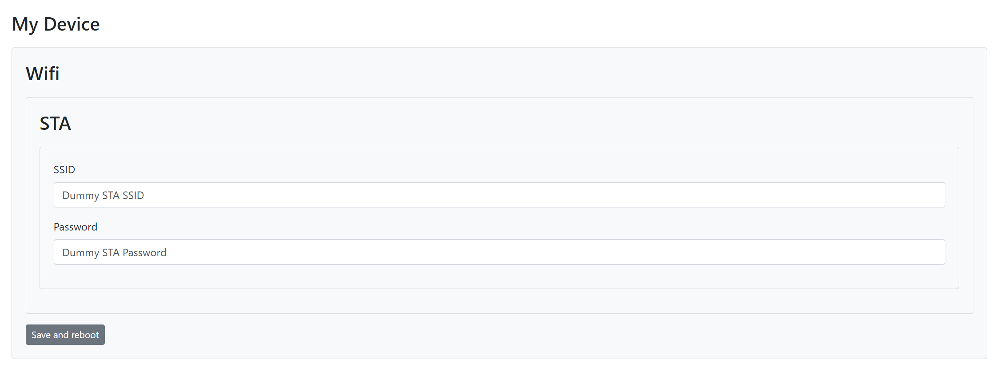
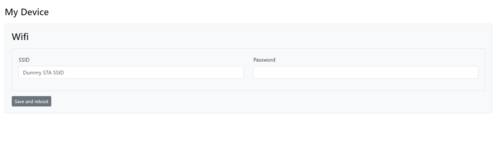

# Mongoose OS JSON Schema web UI

Web UI settings page generated via [JSON Schema](https://json-schema.org/). 

UI is based on [JSON Editor](https://github.com/json-editor/json-editor) library with some additional adjustments to save data into Mongoose OS [config](https://mongoose-os.com/docs/mongoose-os/api/core/mgos_sys_config.h.md) and perform Mongoose OS [RPC](https://mongoose-os.com/docs/mongoose-os/userguide/rpc.md) calls from generated page.

Please check documentation of JSON Editor library before - all magic is done on their side, this library is a just wrapper.

## Usage

### Config Form

If you want to allow editing part of Mongoose OS config you could define your schema like this:

```yml
mos.yml
...
config_schema:
  - ["jsonschemawebui.config.schema", '{
    "title": "My Device",
    "type": "object",
    "properties": {
      "wifi": {
        "title": "Wifi",        
        "type": "object",
        "properties": {
          "sta": {
            "title": "STA",       
            "type": "object",
            "properties": {
              "ssid": {
                "type": "string",
                "title": "SSID"
              },
              "password": {
                "type": "string",
                "title": "Password"
              }
            }
          }
        }
      },
      "submit": {
        "type": "button",
        "title": "Save and reboot",
        "options": {
          "button": {
            "action": "save-config",
            "save-config": {
              "reboot": true
            }
          }
        }
      }
    }
  }']
...
```
`schema` - should describe fields from config which you want to show.

`submit` - this field could be named with any name while it's type button and `action` is `save-config`

This will generate a page which will looks like this:



### Custom form

You could describe your custom form with mapping to Mongoose OS config like this:

```yml
mos.yml
...
config_schema:
  - ["jsonschemawebui.customconfig.schema", '{
    "title": "My Device",
    "type": "object",
    "properties": {
      "wifi-group": {
        "type": "object",
        "title": "Wifi",
        "format": "grid",
        "properties": {
          "ssid": {
            "type": "string",
            "title": "SSID"
          },
          "password": {
            "type": "string",
            "title": "Password"
          }
        }
      },
      "submit": {
        "type": "button",
        "title": "Save and reboot",
        "options": {
          "button": {
            "action": "save-config",
            "save-config": {
              "reboot": true
            }
          }
        }
      }
    }
  }']
  - ["jsonschemawebui.customconfig.mapping", '{
    "wifi-group.ssid": "wifi.sta.ssid",
    "wifi-group.password": "wifi.sta.password"
  }']
...
```
`schema` - is your custom JSON Schema, do what ever you want there and put what ever fields you want in any nestings

`jsonschemawebui.customconfig.mapping` - this is mapping from your form values to values from Mongoose OS config

This will generate a page which will looks like this:



### RPC calls

Inside your schema (doesn't matter is it config or custom form) you could use buttons to call RPC.

```yml
mos.yml
...
config_schema:
  - ["jsonschemawebui.config.schema", '{
    "title": "My Device",
    "type": "object",
    "required": ["rpc-call-group"],
    "properties": {
      "rpc1": {
        "type": "button",
        "title": "My RPC 1",
        "options": {
          "button": {
            "action": "rpc-call",
            "rpc-call": {
              "name": "RPC_NAME1"
            }
          }
        }
      },
      "rpc-call-group": {
        "type": "object",
        "title": "RPC group",
        "format": "grid",
        "properties": {
          "rpc2": {
            "type": "button",
            "title": "My RPC 2",
            "options": {
              "button": {
                "action": "rpc-call",
                "rpc-call": {
                  "name": "RPC_NAME2",
                  "params": {
                    "some-param": "some-value"
                  }
                }
              }
            }
          },
          "rpc3": {
            "type": "button",
            "title": "My RPC 3",
            "options": {
              "button": {
                "action": "rpc-call",
                "rpc-call": {
                  "name": "RPC_NAME3"
                }
              }
            }
          }
        }
      },
      "submit": {
        "type": "button",
        "title": "Save and reboot",
        "options": {
          "button": {
            "action": "save-config",
            "save-config": {
              "reboot": true
            }
          }
        }
      }
    }                                        
  }']
...
```
`name` - is name of your RCP

`params` - not params to your RPC if you need them

`"required": ["rpc-call-group"]` - this is a little hack, with this line your `rpc-call-group` will be hidden because there are no value from config

This will generate a page which will looks like this:


## Future plans

 - For now build of this library based on bootstrap, but probably there should be ability to create builds based on different UI Frameworks with different Icon Packs (https://github.com/json-editor/json-editor#css-integration).
 - Some additional inputs which are specific for Mongoose OS environment could be added (select for available WIFI access points, etc.).
 - `params` for `"action": "rpc-call"` for now defined on JSON Schema itself but probably there should be ability to fill those params from UI form.
 - array support of config
 - it could be minimized by using only parts of UI Frameworks like bootstrap or even html page could be generated on build stage

## Development

Run `npm run build` to build gziped `fs` folder.

Run `npm run watch` to build and watch gziped `fs` folder.

Run `npm run serve` to serve `fs` folder during development.

PS: If you like this idea and you have time to maintain this package - please feel free to create a fork or create a new repo for this, and I'll remove this library from my account - unfortunately I have no time to maintain it, so probably after some time this repo becomes dead :( 